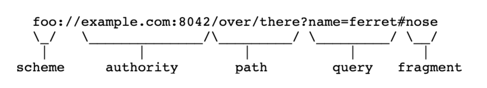

웹해킹_1주차
===

# 웹 기초 지식

## 웹페이지의 구성

- HTML: 웹 문서의 뼈대, 태그와 속성을 지정하여 문서를 구성
-  css: 웹 리소스 출력시 스타일을 설정하는 것
- JS: client side script로 페이지 내에서의 행위들을 설정함

## URI(URL)의 구성

- scheme: 웹 서버에 접속할 때 프로토콜을 사용할지에 대한 정보를 담고 있음
- host: authority의 일부, 접속할 웹 서버의 주소에 대한 정보를 가지고 있음
- port: authority의 일부, 접속할 웹 서버의 포트에 대한 정보를 가지고 있음
- path: 접속할 웹 서버의 경로에 대한 정보를 가지고 있음, /로 구분
- query: 웹 서버에 전달하는 추가적인 정보, URI에서 ? 뒤에 붙음
- fragment: 메인 리소스 내에 존재하는 서브 리소스에 접근할 때 이를 식별하기 위한 정보를 담고 있음, URI에서 # 뒤에 붙음

# 웹 해킹이란?

